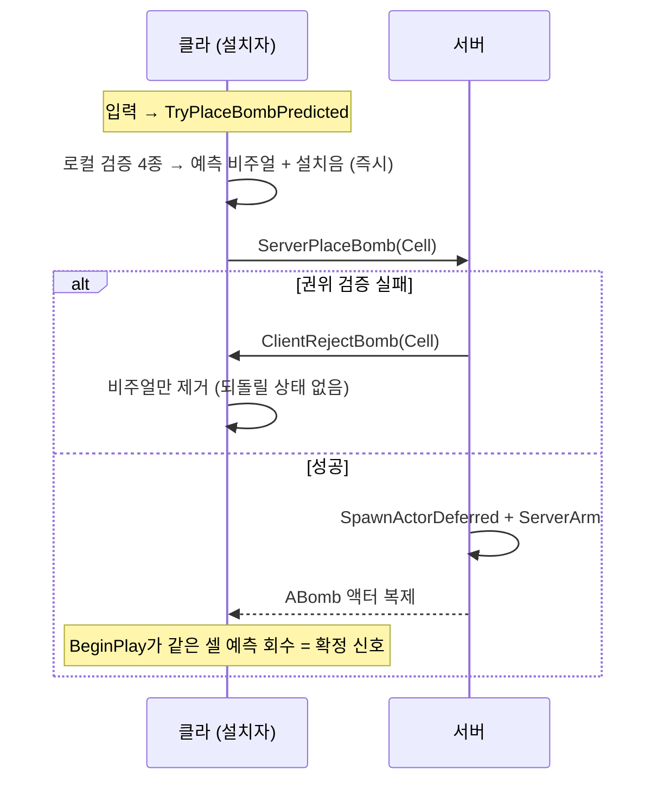

# ACA3DCharacter

> `Gameplay/Character/CA3DCharacter.h/.cpp` · ACharacter — 사람·봇 공용

## 역할
- 행동 진입점: `Move`/`DoJump` · `TryPlaceBombPredicted` · `TryUseNeedle` ·
  킥 시도(매 틱) · 갇힌 상대 터뜨리기 검사
- 판정 기준점: `GetFootCell()`(발밑 셀) · `GetContactReach()`(접촉 거리)
- 사망 적용(`ApplyDeathState`) · 시점 각 결정(`GetViewRotation`)
- 스탯 보관 안 함 — `UStatusComponent` 소관

## 주요 변수·함수
| 이름 | 설명 | 멀티 이유 |
|---|---|---|
| `PredictedBombVisuals` | 내 예측 비주얼 목록 | 클라 로컬 — 서버는 이 목록의 존재를 모름 |
| `GetStatus()` / `GetFootCell()` | 스탯 접근 · 발밑 셀 | |
| `Move` / `DoJump` | 이동·점프 진입점 (생존 가드) | 이동 복제는 CMC 기본(서버 검증+클라 예측)에 맡김 — 직접 만들지 않음 |
| `RefreshMoveSpeed()` | 속도 재계산 단일 경로 | 서버·클라 각자 실행 — 스탯이 복제되므로 같은 결과 |
| `ApplyDeathState()` | 캡슐 off·MOVE_None·액터 숨김 | 서버(`ServerKill`)와 클라(`OnRep_Life`)가 **같은 함수를 각자 실행** — 컬리전·이동 모드는 비복제 값이라 복제에 못 맡김 |
| `TryGetBombPlacementCell(Out)` | 설치 셀 계산 (-Z 스캔) | 실패 시 RPC 자체 생략 — 무의미한 왕복 절약 |
| `TryPlaceBombPredicted()` | 설치 단일 진입점 | `HasAuthority()` 분기 — 리슨 호스트·봇은 예측 생략(진짜와 겹침 방지), 원격 클라만 예측 |
| `TryAcquirePredictedVisual(Cell)` (내부) | 로컬 검증 4종 → 풀 획득 + 설치음 | 검증 실패면 RPC를 안 보냄 — 서버 부하·거부 왕복 절약. 개수는 복제 지연 값 대신 예측 비주얼 수로 셈 |
| `ReleasePredictedVisualAt(Cell)` | 예측 회수 → bool | bool = "방금 내 예측을 회수했나" — 설치음 1회 보장의 유일한 스위치 |
| `ServerPlaceBomb(Cell)` (Server RPC) | 권위 검증 4종 → Deferred 스폰 | **상태 변경은 서버만** — 클라 검증은 편의일 뿐, 진실은 이 검증 |
| `ClientRejectBomb(Cell)` (Client RPC) | 거부 통지 | 소유 클라에게만 — 남은 알 필요 없음(예측은 설치자 화면에만 존재) |
| `TryUseNeedle()` / `ServerUseNeedle` (Server RPC) | 니들 수동 사용 | 니들 소모 = 서버 스탯 변경. 클라는 사전검사만 |
| `ServerTryKickBomb(Dir)` (서버 틱) | 방향 접기 → 접촉 검사 → 킥 | 서버에서만 — 킥은 예측 금지. 클라 입력은 CMC 가속 복제로 이미 서버에 있음 |
| `ServerTryPopIfTouched()` (서버 틱) | 갇힌 쪽이 접촉 검사 → Popped | 즉사 판정은 권한. 검사 주체 반전으로 서버 비용 최소화 |
| `GetContactReach(a, b)` | 킥·터뜨리기 공용 접촉 공식 | |
| `GetViewRotation()` (override) | 보는 로컬 컨트롤러 각 우선, 없으면 복제 `CamYawIndex` | 컨트롤러 yaw는 **복제 안 됨** + 원격 폰은 Controller==nullptr → 엔진 폴백 0도(카메라 눕는 버그)의 해법 |
| `Tick` (서버) | KillZ 낙사 → 킥 시도 → 터뜨리기 | 전부 서버 판정 — 클라 Tick은 시각만 |

## 왜
- **왜 사람·봇 공용?** → 봇 전용 경로 = 검증 두 벌. 사람이 못 하는 건 봇도 못 함
- **왜 발밑 셀이 판정 중심?** → "발판만이 안전하다": 층 이동 점프 = 셀 바뀜 = 회피,
  제자리 점프 = 셀 그대로 = 피격
- **왜 이동 수치가 계수×CellSize?** → 셀 크기 변경에도 감각 유지 + 매직 넘버 금지
- **왜 ApplyDeathState가 공통 단일 지점?** → 컬리전·이동 모드는 비복제 값 —
  서버·클라 각자 같은 함수 실행. 숨김은 **액터 단위**(메시 하나만 끄면 BP 추가 메시가
  남음 — 실제 사고). 폰 파괴 안 함 — 부활 여지
- **왜 Move는 Dead만 차단, DoJump는 Alive만 통과?** → 갇힘 중 미세 이동 허용·점프 탈출
  금지 (사용자 확정). 가드가 캐릭터에 있는 이유: 봇도 같은 경로
- **왜 GetViewRotation 오버라이드?** → 카메라 yaw 비복제 → 원격 폰은 0도(카메라 눕는 버그).
  보는 로컬 컨트롤러의 각 우선, 없으면 복제 `CamYawIndex`
- **왜 GetContactReach 공용?** → 킥·터뜨리기가 한 벌. 두 벌이면 "킥은 되는데
  터뜨리기는 안 되는 거리"
- **공중 설치 = -Z 스캔** (잠정) → 아래 첫 솔리드 위 셀. 그리드 밖이면 RPC 자체 생략

## 멀티 처리

**"입력 → 로컬 예측 → Server RPC → 권위 검증 → 복제"의 표준 예측 패턴.**
이동은 CMC 기본 복제(엔진), 스탯·생존은 StatusComponent 복제, 폭탄은 예측+RPC.
상태를 바꾸는 RPC는 3개뿐이고 나머지 판정(킥·터뜨리기·낙사)은 서버 틱이 스스로 돈다.
RPC 3: `ServerPlaceBomb` · `ClientRejectBomb` · `ServerUseNeedle`. 자체 복제 없음

## 연결
[24-StatusComponent.md](24-StatusComponent.md) · [18-PredictedBombVisual.md](../Bomb/18-PredictedBombVisual.md) · [26-CA3DPlayerController.md](26-CA3DPlayerController.md) · [37-BotController.md](../../AI/37-BotController.md)

## Q&A
아직 없음
