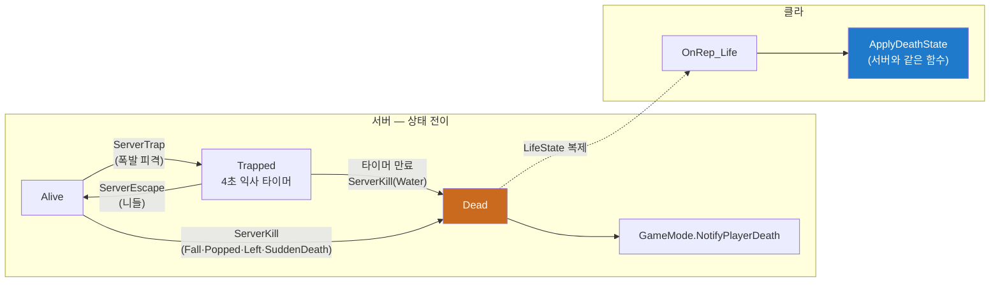

# UStatusComponent

> `Gameplay/Character/StatusComponent.h/.cpp` · UActorComponent

## 역할
- 스탯 보관·복제: 폭탄 수·범위·속도 배수·니들·킥
- 생존 상태 전이: Alive → Trapped(4초 익사 타이머) → 탈출 or 사망(사인 기록)
- 아이템 효과 적용(`ServerApplyItem`) + 판정 짝(`HasRoomForItem`)
- 사망을 GameMode에 통지. 순위 판정은 안 함

## 주요 변수·함수
| 이름 | 설명 | 멀티 이유 |
|---|---|---|
| `MaxBombCount` / `BombRange` / `MoveSpeedMul` (복제·OnRep_Stats) | 스탯 3종 | HUD 표시 + 클라 로컬 검증(설치 예측)의 재료. OnRep → 속도 재계산 |
| `bHasNeedle` / `bHasKick` (복제) | 보유 플래그 | HUD 표시 + 니들 사전검사 |
| `LifeState` (복제·OnRep_Life) | Alive/Trapped/Dead | **사망의 시각 처리를 클라가 같은 함수로** 하기 위한 유일한 신호 |
| `ActiveBombCount` (비복제) | 설치 중 개수 | **일부러 비복제** — 서버 판정 전용. 복제 지연 값으로 클라가 예측하면 오히려 틀림(예측 비주얼 수로 대체) |
| `LastDeathCause` (비복제) | 사인 5종 | 서버 로그·집계용 — 클라 표시에 안 쓰여 복제 불필요 |
| `TrappedTimer` | 익사 예약 | 서버 타이머 — 갇힘 연출은 LifeState 복제로 충분 |
| `ServerApplyItem(Type)` | 효과 적용 (Cap 클램프) | RPC 아님 — 서버 안(아이템 오버랩)에서만 호출. 서버는 OnRep이 안 불려 속도 재계산 직접 |
| `HasRoomForItem(Type)` | "받으면 오르는가" (봇용) | |
| `ServerTrap()` / `ServerEscape()` / `ServerKill(Cause)` | 상태 전이 3종 | **전부 RPC가 아니라 서버 로컬 진입점 + `HasAuthority()` 가드** — 상태 변경 표면을 좁혀 검증 지점 최소화(불변식 5). 클라 요청은 캐릭터 RPC 경유 |
| `OnRep_Life()` | 클라 수신부 | 서버와 같은 `ApplyDeathState` 통과(불변식 1의 캐릭터판) — 죽은 본인 화면과 남의 화면이 같아짐 |
| `RefreshOwnerMoveSpeed()` (내부) | 속도 재계산 호출 | 서버·클라 각자 — 결과가 복제 스탯의 함수라 동일 |

## 왜
- **왜 컴포넌트?** → 설계 결정 8: 봇·사람 코드 경로 동일. 캐릭터=행동, 컴포넌트=상태
- **왜 RPC 0개?** → 전부 서버 로컬 진입점 + `HasAuthority()` 가드.
  클라 요청은 캐릭터 RPC가 받음. 상태 변경 표면 최소화 (불변식 5)
- **왜 ActiveBombCount 비복제?** → 서버 판정 전용. 클라 예측은 예측 비주얼 개수로 —
  복제 지연 값으로 예측하면 오히려 틀림
- **왜 ServerTrap이 Alive만?** → 중복 갇힘·시체 갇힘 방지 + "갇힌 상대에게 폭탄 무효"
  원작 규칙이 공짜 (봇 PopTrapped 우선순위의 근거)
- **왜 EDeathCause 구분?** → 사인 집계·밸런스 신호(예: "익사 0건"). 새 값은 끝에 append
- **왜 속도 재계산이 단일 경로?** → 롤러·갇힘·사망이 제각각 만지면 복원이 꼬임
- **왜 HasRoomForItem이 여기?** → `ServerApplyItem` 바로 옆. 봇 파일에 있으면
  "봇은 상한인 줄 아는데 실제로는 오르는" 어긋남

## 멀티 처리

**상태의 진실은 서버, 클라는 OnRep으로 결과만 받는다.** 클라→서버 방향은 이 컴포넌트에
없다(캐릭터 RPC가 대신 받아 서버 안에서 이 진입점들을 부름). 복제 6: 스탯 5 +
`LifeState`(OnRep_Life → ApplyDeathState 공통 경로)

## 연결
[23-CA3DCharacter.md](23-CA3DCharacter.md) · 갇힘 호출: [16-ExplosionSubsystem.md](../Bomb/16-ExplosionSubsystem.md) · 통지: [35-CA3DGameMode.md](../../Framework/35-CA3DGameMode.md)

## Q&A
아직 없음
