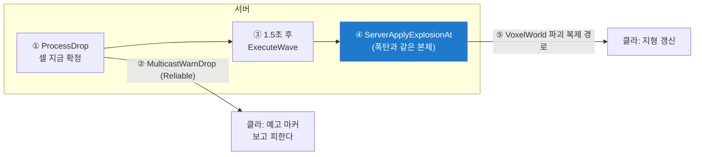

# USuddenDeathSubsystem (+ Relay · DropMarker)

> `Gameplay/SuddenDeath/SuddenDeathSubsystem.h/.cpp` · 한 파일 3클래스 (1 Task=1 Class 예외)

## 역할
- **Subsystem**: 서버 낙하 스케줄러 — 주기 추첨 → 예고 방송 → 지연 후 폭발 적용 위임
- **Relay**(AInfo): 예고 Multicast 스피커 / **DropMarker**: 예고 마커 표시(풀링)

## 주요 변수·함수
| 이름 | 설명 | 멀티 이유 |
|---|---|---|
| `bRunning` / `DropTimer` / `Stream` | 실행 플래그 · 주기 타이머 · 난수 | 전부 서버 전용. `Stream`은 `FMath::Rand()` 시드 — 결과를 Multicast로 알리므로 **클라 재현이 불필요**해 결정론 제약(불변식 4)이 안 걸림 |
| `PendingWaves` (배열) | 예고 중 웨이브들 | 서버 전용 — 클라는 웨이브 개념을 모르고 "이 셀들 곧 떨어짐"만 받음 |
| `ServerStart() / ServerStop()` | GameMode 스위치 | 서버 전용 — 클라 표시는 GameState의 `bSuddenDeathActive` 복제로 |
| `ProcessDrop()` (주기) | 추첨 → 확정 → 예고 방송 → 실행 예약 | 셀을 **예고 시점에 확정** — 예고와 실제가 같은 데이터여야 "보고 피한다"가 성립 |
| `ExecuteWave(Id)` | 셀마다 `ServerApplyExplosionAt` | 파괴 전달은 VoxelWorld의 기존 복제 경로 재사용 — 새 통신 없음 |
| `PickDropCell(...)` (static) | 낙하 후보 추첨 | |
| `Relay::MulticastWarnDrop(Cells, Delay)` (Reliable) | 예고: 경고 큐 + 마커 | **Reliable** — 예고가 빠지면 회피 불가 = 게임 규칙 훼손. 서브시스템은 RPC 불가라 릴레이가 방송 |
| `DropMarker::StartWarning(Seconds)` | 마커 표시 후 자체 반납 | 비복제 — 각 클라 로컬 스폰 (물줄기와 같은 패턴) |

## 왜
- **⭐ Propagate 무수정** → `bFloorDestructible`이 이미 인자(불변식 2의 회수).
  서든데스는 자기 룰셋 값만 넘김 — "낙하만 바닥을 부순다"
- **왜 폭발 적용을 폭탄과 공유?** → `ServerApplyExplosionAt` → 같은 `ApplyExplosionCells`.
  따로면 "서든데스로 부순 블록만 다르게 동작". 연쇄 유발은 적용 **후** (순서 뒤집으면
  안 부서진 그리드를 읽음)
- **왜 웨이브 배열?** → 예고(1.5s) > 간격(1.0s)이라 예고 중 웨이브가 동시 다수.
  핸들 하나면 뒤가 앞을 덮어 앞 웨이브가 영영 안 떨어짐
- **왜 셀을 예고 시점에 확정?** → 만료 시 재추첨 = 마커와 실제 어긋남 = "보고 피한다" 붕괴
- **왜 FMath::Rand 허용?** → 서버 단독 결정 + Multicast 통지. 클라 재현 불필요
- **왜 Relay 분리?** → 서브시스템은 RPC 불가. 경고음이 마커 확인보다 위 —
  마커 에셋 없어도 소리는 나야 함
- **왜 정지 시 웨이브 전부 해제?** → 결과 화면 뒤에 블록이 떨어지면 안 됨
- **왜 마커 타입 고정?** → 순수 AActor면 풀 Acquire가 ensure로 낙하마다 터짐
- **낙사 원인은 시각으로 판정** → 그리드에 파괴 원인을 넣으면 Voxel 독립성 붕괴.
  통계에 그 비용을 안 치름

## 멀티 처리

**낙하 결정은 서버 단독**(난수도 서버 로컬 — 클라 재현 불필요). 클라에는 두 경로로만 전달:
예고는 `MulticastWarnDrop`(마커), 실제 파괴는 폭탄과 같은 VoxelWorld 복제 경로.
활성 여부는 GameState `bSuddenDeathActive` 복제로 HUD·사인 분기가 읽는다.

## 연결
[16-ExplosionSubsystem.md](../Bomb/16-ExplosionSubsystem.md) · 스위치: [35-CA3DGameMode.md](../../Framework/35-CA3DGameMode.md)

## Q&A
아직 없음
