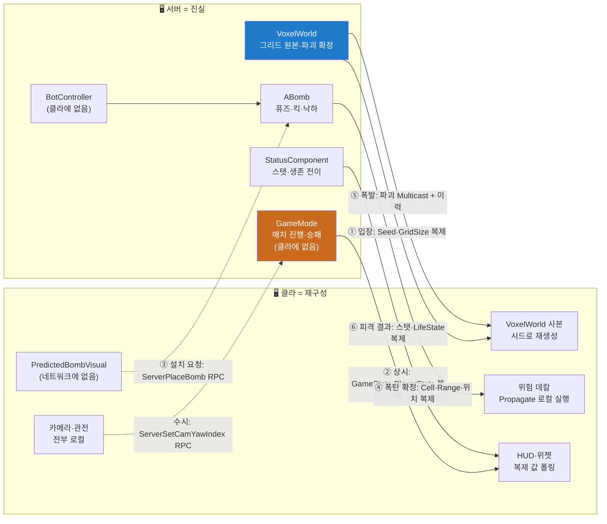

# Docs — 클래스별 설계 이유 노트

코드 스터디용 문서. **1 클래스 = 1 md**, Tests 폴더 제외.
각 파일은 "무엇인가"보다 **"왜 이렇게 했는가"** 를 중심으로 쓴다.
공부하면서 물어본 질문과 답은 각 파일의 **Q&A** 절에 쌓는다.

**파일명 앞 번호 = 권장 읽기 순서.** 의존 그래프의 맨 아래(아무것도 의존하지 않는 쪽)부터 위로 올라간다.

## 1단계 · Voxel — 지형이 곧 게임 상태다 (01~07)

| # | 파일 | 클래스 | 한 줄 |
|---|---|---|---|
| 01 | [Voxel/01-VoxelTypes.md](Voxel/01-VoxelTypes.md) | `EBlockType` | 블록 4종 enum |
| 02 | [Voxel/02-VoxelGrid.md](Voxel/02-VoxelGrid.md) | `FVoxelGrid` | 지형의 유일한 실체 — 평탄화 uint8 배열 |
| 03 | [Voxel/03-VoxelWorld.md](Voxel/03-VoxelWorld.md) | `AVoxelWorld` | 그리드 소유·권한·복제·파괴 단일 경로 |
| 04 | [Voxel/04-VoxelRenderer.md](Voxel/04-VoxelRenderer.md) | `IVoxelRenderer` | 렌더 추상화 — 교체 지점 |
| 05 | [Voxel/05-HISMVoxelRenderer.md](Voxel/05-HISMVoxelRenderer.md) | `UHISMVoxelRenderer` | HISM 렌더러 = 지형의 유일한 컬리전 |
| 06 | [Voxel/06-VoxelMovement.md](Voxel/06-VoxelMovement.md) | `VoxelMove` | 이동 규칙 단일 출처 (검증기·봇 공용) |
| 07 | [Voxel/07-VoxelRayCast.md](Voxel/07-VoxelRayCast.md) | `VoxelRay` | 3D DDA 순수 함수 |

## 2단계 · MapGen — 시드 하나가 지형을 복제한다 (08~12)

| # | 파일 | 클래스 | 한 줄 |
|---|---|---|---|
| 08 | [MapGen/08-MapGenerator.md](MapGen/08-MapGenerator.md) | `IMapGenerator` | 생성기 계약 — 같은 입력 = 같은 출력 |
| 09 | [MapGen/09-ProcMapGenerator.md](MapGen/09-ProcMapGenerator.md) | `UProcMapGenerator` | 절차 생성 + 리롤 루프 |
| 10 | [MapGen/10-FallbackMapGenerator.md](MapGen/10-FallbackMapGenerator.md) | `UFallbackMapGenerator` | 하드코딩 폴백 — 실패도 결정론 |
| 11 | [MapGen/11-MapValidator.md](MapGen/11-MapValidator.md) | `FMapValidator` | 검증 5종 순수 함수 |
| 12 | [MapGen/12-MapGenUtil.md](MapGen/12-MapGenUtil.md) | `FMapGenUtil` | 아이템 배치 공용 본체 |

## 3단계 · Core 풀 — 폭탄 축을 읽기 전 준비물 (13~14)

| # | 파일 | 클래스 | 한 줄 |
|---|---|---|---|
| 13 | [Core/13-PooledActor.md](Core/13-PooledActor.md) | `IPooledActor` | 풀 수명 콜백 계약 |
| 14 | [Core/14-PoolSubsystem.md](Core/14-PoolSubsystem.md) | `UPoolSubsystem` | 제네릭 액터 풀 (클라 시각 전용) |

## 4단계 · 폭탄 축 — 이 게임의 심장 (15~21)

| # | 파일 | 클래스 | 한 줄 |
|---|---|---|---|
| 15 | [Gameplay/Bomb/15-ExplosionTypes.md](Gameplay/Bomb/15-ExplosionTypes.md) | `FExplosionResult` | 폭발 결과 값 타입 |
| 16 | [Gameplay/Bomb/16-ExplosionSubsystem.md](Gameplay/Bomb/16-ExplosionSubsystem.md) | `UExplosionSubsystem` | Propagate 순수 함수 + 연쇄 스케줄링 |
| 17 | [Gameplay/Bomb/17-Bomb.md](Gameplay/Bomb/17-Bomb.md) | `ABomb` | 서버 권한 폭탄 — 퓨즈·킥·낙하 |
| 18 | [Gameplay/Bomb/18-PredictedBombVisual.md](Gameplay/Bomb/18-PredictedBombVisual.md) | `APredictedBombVisual` | 클라 예측 비주얼 — 로직 0 |
| 19 | [Gameplay/Bomb/19-ExplosionFXRelay.md](Gameplay/Bomb/19-ExplosionFXRelay.md) | `AExplosionFXRelay` | 물줄기 Multicast 소유 액터 |
| 20 | [Gameplay/Bomb/20-WaterSegment.md](Gameplay/Bomb/20-WaterSegment.md) | `AWaterSegment` | 물줄기 1칸 시각·풀링 |
| 21 | [Gameplay/Bomb/21-DangerDecal.md](Gameplay/Bomb/21-DangerDecal.md) | `ADangerDecal` | 위험 프리뷰 데칼 |

## 5단계 · 룰셋·캐릭터·상태 (22~24)

| # | 파일 | 클래스 | 한 줄 |
|---|---|---|---|
| 22 | [Framework/22-CA3DRuleSet.md](Framework/22-CA3DRuleSet.md) | `UCA3DRuleSet` | 튜닝 값 99개 DataAsset — 매직 넘버 금지의 실체 |
| 23 | [Gameplay/Character/23-CA3DCharacter.md](Gameplay/Character/23-CA3DCharacter.md) | `ACA3DCharacter` | 사람·봇 공용 캐릭터 — 행동 진입점 |
| 24 | [Gameplay/Character/24-StatusComponent.md](Gameplay/Character/24-StatusComponent.md) | `UStatusComponent` | 스탯·생존 상태 단일 출처 |

## 6단계 · 카메라·입력·관전 (25~27)

| # | 파일 | 클래스 | 한 줄 |
|---|---|---|---|
| 25 | [Core/25-CameraYawSnap.md](Core/25-CameraYawSnap.md) | `CameraYawSnap` | 스냅 각 단일 출처 (구조 상수) |
| 26 | [Gameplay/Character/26-CA3DPlayerController.md](Gameplay/Character/26-CA3DPlayerController.md) | `ACA3DPlayerController` | 입력 + 스냅 카메라 + 관전 |
| 27 | [Gameplay/Character/27-OcclusionFadeComponent.md](Gameplay/Character/27-OcclusionFadeComponent.md) | `UOcclusionFadeComponent` | 가림 디더 페이드 |

## 7단계 · 아이템·서든데스·피드백 (28~32)

| # | 파일 | 클래스 | 한 줄 |
|---|---|---|---|
| 28 | [Gameplay/Item/28-ItemTypes.md](Gameplay/Item/28-ItemTypes.md) | `EItemType` `FItemPlacement` | 아이템 데이터 타입 |
| 29 | [Gameplay/Item/29-ItemPickup.md](Gameplay/Item/29-ItemPickup.md) | `AItemPickup` | 노출된 아이템 액터 |
| 30 | [Gameplay/SuddenDeath/30-SuddenDeathSubsystem.md](Gameplay/SuddenDeath/30-SuddenDeathSubsystem.md) | `USuddenDeathSubsystem` 외 2 | 서든데스 낙하 스케줄러 |
| 31 | [Gameplay/31-CA3DFeedback.md](Gameplay/31-CA3DFeedback.md) | `CA3DFeedback` 외 2 | 사운드·이펙트 큐 단일 경로 |
| 32 | [Gameplay/32-SpinVisual.md](Gameplay/32-SpinVisual.md) | `CA3DSpin` | 제자리 회전 공용 헬퍼 |

## 8단계 · Framework — 매치의 수명 (33~36)

| # | 파일 | 클래스 | 한 줄 |
|---|---|---|---|
| 33 | [Framework/33-CA3DGameState.md](Framework/33-CA3DGameState.md) | `ACA3DGameState` | 복제되는 매치 상태 — 로직 0 |
| 34 | [Framework/34-CA3DPlayerState.md](Framework/34-CA3DPlayerState.md) | `ACA3DPlayerState` | 참가자 복제 데이터 — 로직 0 |
| 35 | [Framework/35-CA3DGameMode.md](Framework/35-CA3DGameMode.md) | `ACA3DGameMode` | 서버 전용 매치 진행 — 스폰 게이트·승패 판정 |
| 36 | [Framework/36-CA3DGameInstance.md](Framework/36-CA3DGameInstance.md) | `UCA3DGameInstance` | EOS 세션 (보류) |

## 9단계 · 봇으로 총정리 (37)

| # | 파일 | 클래스 | 한 줄 |
|---|---|---|---|
| 37 | [AI/37-BotController.md](AI/37-BotController.md) | `ABotController` | 순수 C++ FSM 봇 — 위 전부를 소비하는 클라이언트 |

## 10단계 · UI (38~39)

| # | 파일 | 클래스 | 한 줄 |
|---|---|---|---|
| 38 | [UI/38-CA3DHUD.md](UI/38-CA3DHUD.md) | `ACA3DHUD` | 위젯 수명 + 캔버스 폴백 |
| 39 | [UI/39-MatchWidget.md](UI/39-MatchWidget.md) | `UMatchWidget` | HUD 위젯 — 순수 함수 + 폴링 |

---

## 멀티 처리 개요 — 이 프로젝트의 넷코드 한 장 요약

**원칙: 서버가 모든 판정의 진실이고, 클라는 "받은 값으로 로컬 재구성"한다.**

번호 = 매치 한 판의 전형적 진행 순서. 실선 = 서버→클라 (복제·Multicast) / 점선 = 클라→서버 (Server RPC — 프로젝트 전체에 4개뿐). 전달 수단은 넷뿐:

| 수단 | 쓰는 곳 | 왜 |
|---|---|---|
| **시드 복제 + 재생성** | 지형 (`Seed`·`GridSize`) | 데이터 대신 시드 하나 — 생성기가 결정론이라 "다른 지형"이 원천 불가 |
| **프로퍼티 복제 (24개)** | 스탯·생존·순위·폭탄 셀 등 | 상태는 서버가 쓰고 클라는 OnRep/폴링으로 읽기만 |
| **RPC (8개)** | 요청 3(Server) · 거부 1(Client) · 방송 4(Multicast) | 상태 변경 요청은 Server RPC로만, 사건 통지는 릴레이 Multicast로만 |
| **전송 안 함** | 위험 프리뷰·관전 시점·FX·타이머 | 같은 순수 함수(`Propagate` 등)를 로컬 실행하거나, 애초에 로컬 관심사 |

- **예측은 폭탄 설치 하나뿐**, 그마저 로직 0(비주얼만) — 되감을 상태를 안 만들어 불일치 원천 차단
- **늦은 접속자**는 이력 배열(`DestroyedCells`)로 따라잡는다 — Multicast는 그 순간 접속자에게만 가므로
- **Reliable/Unreliable 기준**: 빠지면 규칙 이해가 깨지는 것(물줄기·낙하 예고)은 Reliable,
  빠져도 무해한 것(효과음)은 Unreliable
- 상세는 각 문서의 **"멀티 이유" 열**과 **"멀티 처리" 절** 참조

---

따라가는 요령: 함수마다 **"누가 부르나 / 서버인가 클라인가"** 두 질문만 계속 던진다.
각 클래스에 짝이 되는 테스트(`Source/CrazyArcade3D/Tests/`)가 "이 클래스가 보장하는 것"의 목록이다.
