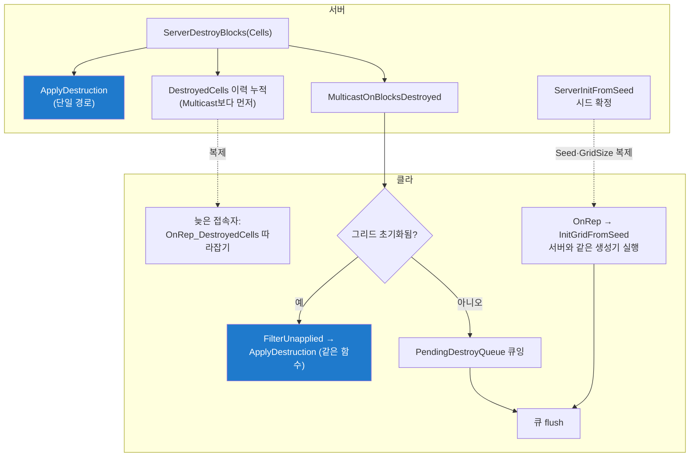

# AVoxelWorld

> `Voxel/VoxelWorld.h/.cpp` · AActor (bReplicates · bAlwaysRelevant) — 레벨에 1개

## 역할
- `FVoxelGrid` 소유 + 엔진 결합: 복제(Seed·GridSize·DestroyedCells) · 파괴 단일 경로
- 서버: `ServerInitFromSeed` · `ServerDestroyBlocks` / 클라: OnRep으로 재생성·따라잡기
- 좌표 변환(`WorldToCell`/`CellToWorld`) · 스폰 셀·아이템 배치 보관 · `OnGridChanged` 알림

## 주요 변수·함수
| 이름 | 설명 | 멀티 이유 |
|---|---|---|
| `Grid` (FVoxelGrid) | 소유한 지형 데이터 | **비복제** — 시드로 재생성하므로 데이터 자체를 보낼 이유가 없음 |
| `Seed` / `GridSize` (복제·OnRep) | 클라 재생성의 입력 두 개 | 서버·클라 시드가 다르면 지형이 갈라짐 — 시드는 **서버(GameMode)가 정하고 복제로만** 전달, 생성기는 받은 시드를 소비만. 크기도 클라가 인원수로 유추하면 중간 접속자가 다른 맵을 만듦 |
| `DestroyedCells` (복제 배열·OnRep) | 파괴 이력 | 서버에서 파괴된 내용의 전달 — Multicast는 그 순간 접속자에게만 가므로, **늦게 온 클라**는 이 배열로 따라잡음 |
| `SpawnCells` / `ItemPlacements` | 생성기가 낸 스폰 셀·아이템 배치 | 서버 로컬 — 스폰은 서버 판정, 아이템은 노출 순간 복제 액터로 나감 |
| `PendingDestroyQueue` | 그리드 초기화 전 도착한 파괴 대기열 | 복제 순서 무보장 — 파괴 Multicast가 `OnRep_Seed`보다 먼저 올 수 있어 큐가 필요 |
| `CellSize` (=100) | 셀 한 변 cm — 좌표 변환 기준 | |
| `OnGridChanged` (델리게이트) | "이 셀들이 비워졌다" 알림 | 로컬 이벤트 — 각 머신이 자기 ApplyDestruction 직후 발화 (전송 아님) |
| `ServerInitFromSeed(Seed, Size)` | 서버: 시드 확정 + 생성 시작 | `HasAuthority()` 가드 — 시드 결정은 권한. 값이 복제되면 클라가 알아서 재생성 |
| `ServerDestroyBlocks(Cells)` | 서버: 파괴 확정 | 적용 + **이력 누적을 Multicast보다 먼저** — 순서가 뒤집히면 수신·이력 사이 틈이 생김 |
| `ApplyDestruction(Cells)` | **단일 경로** — 그리드→렌더→델리게이트 | 서버·클라가 같은 함수(불변식 1) — 경로 두 벌이면 반드시 어긋남 |
| `MulticastOnBlocksDestroyed` (Reliable) | 클라 수신부 | 리슨 서버는 `HasAuthority()`로 스킵(이중 파괴 방지) · 그리드 미초기화면 큐잉 |
| `OnRep_Seed / OnRep_GridSize` | → `InitGridFromSeed()` | 둘의 도착 순서 계약 없음 — 어느 쪽이 먼저든 재진입 가드로 1회만 생성 |
| `OnRep_DestroyedCells` | 이력 따라잡기 | 중간 접속자의 유일한 복구 경로 — `FilterUnapplied`로 미적용분만 |
| `FilterUnapplied(Cells)` | 이미 Empty인 셀 제외 | 같은 셀이 Multicast와 이력 양쪽으로 두 번 올 수 있음 — 중복 적용 무해화 |
| `WorldToCell / CellToWorld / CellToWorldFloor` | 월드 ↔ 셀 변환 | |
| `ConsumeItemPlacement(Cell, OutType)` | 배치 예약 1회 소비 | 서버 전용 — 아이템 스폰 권한과 함께 움직임 |
| `SetCellFade / GetCellFade` | 렌더러 위임 (없으면 false/-1) | 로컬 시각 — 전송 없음 |

## 왜
- **왜 지형을 시드로 보내나?** → 데이터 복제 대신 Seed 하나 + 클라가 같은 순수 함수로
  재생성. 생성기가 결정론이면 "서버와 다른 지형"이 원천 불가
- **왜 GridSize 별도 복제?** → 크기는 인원 티어로 서버가 결정. 클라가 유추하면
  중간 접속자가 다른 맵을 만듦
- **왜 ApplyDestruction 단일 경로?(불변식 1)** → 서버 직접 호출 + Multicast 수신이
  같은 함수. 경로 두 벌 = 반드시 어긋남. 해시 30건 일치로 실증
- **왜 DestroyedCells 이력?** → Multicast는 그 순간 접속자에게만 감.
  늦은 접속자는 OnRep에서 미적용분만 따라잡음
- **왜 선도착 큐?** → 파괴 Multicast가 OnRep_Seed보다 먼저 올 수 있음.
  그리드 초기화 전 파괴는 큐 → 초기화 직후 flush
- **왜 "실제로 바뀐 칸"만 알림?** → 같은 셀 중복 요청이 정상 경로(따라잡기·연쇄 겹침).
  요청 목록 그대로 방송하면 구독자(파괴음)가 헛돎
- **왜 OnGridChanged 델리게이트?** → 파괴음을 Voxel에 넣지 않기 위해.
  Voxel은 "비워진 셀"만 알리고 Gameplay가 구독
- **왜 아이템은 데이터만?** → 지형은 아이템 액터를 모름. 스폰은 Gameplay 소관

## 멀티 처리

**서버가 진실(그리드)을 소유한다.** 초기 상태는 Seed·GridSize 복제 → 클라가 같은 순수 함수로
재생성, 이후 변경은 Multicast(즉시) + `DestroyedCells` 이력(늦은 접속자)의 이중 전달.
상태를 바꾸는 함수는 전부 `HasAuthority()` 가드 — Server RPC 자체가 없다
(파괴 요청은 캐릭터 RPC → 폭발 시스템 경유로만 들어온다).
복제 3(전부 OnRep) · RPC 1(`MulticastOnBlocksDestroyed`)

## 연결
[02-VoxelGrid.md](02-VoxelGrid.md) · [04-VoxelRenderer.md](04-VoxelRenderer.md) · 호출자: [16-ExplosionSubsystem.md](../Gameplay/Bomb/16-ExplosionSubsystem.md)

## Q&A
아직 없음
